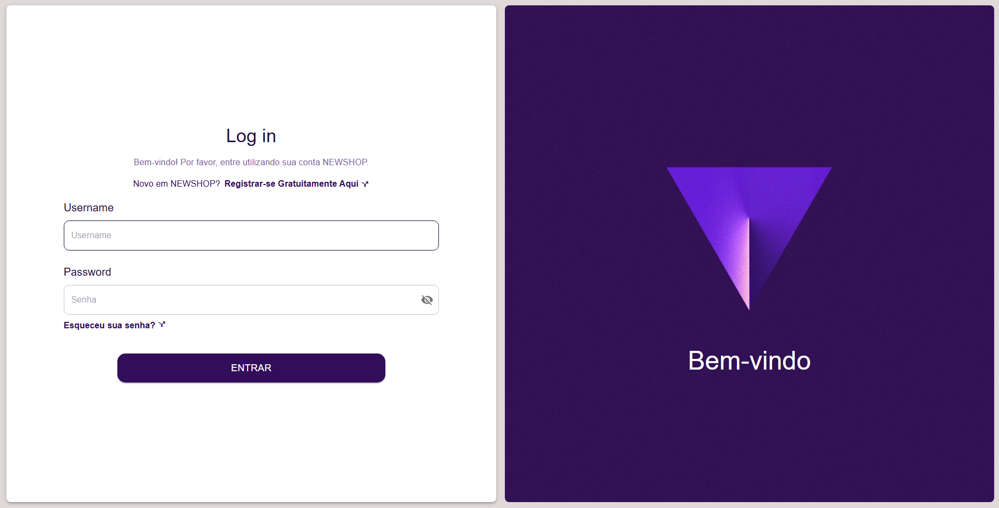
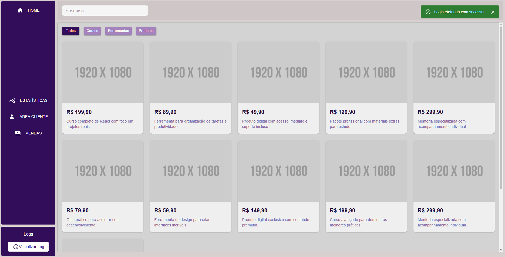

## 📌 Sobre o projeto

Aplicação web desenvolvida com React, TypeScript e Material UI.

O sistema simula um painel administrativo de uma loja virtual, permitindo visualizar produtos por categoria, gerenciar logs de ações e navegar entre diferentes funcionalidades da aplicação.

Este projeto foi desenvolvido com foco em boas práticas de arquitetura frontend, responsividade e escalabilidade para futura integração com Firebase.

## 🖼️ Preview



## 🚀 Tecnologias

- React
- TypeScript
- Vite
- Material UI
- React Router

## 📂 Estrutura

src/
 ├── assets/        # Imagens, ícones e arquivos estáticos
 ├── components/    # Componentes reutilizáveis da aplicação
 ├── data/          # Dados mockados utilizados no projeto
 ├── hooks/         # Hooks customizados
 ├── pages/         # Páginas principais da aplicação
 ├── routes/        # Configuração de rotas da aplicação
 ├── services/      # Camada de serviços (API, Firebase futuramente)
 ├── theme/         # Configuração do tema do Material UI
 ├── types/         # Tipagens TypeScript globais
 ├── App.tsx        # Componente raiz da aplicação
 └── main.tsx       # Ponto de entrada da aplicação

 ## 🔮 Melhorias futuras

- Integração com Firebase Authentication
- Persistência de dados com Firestore
- Cadastro de usuários
- Dashboard com métricas

## ▶️ Executar

```bash
npm install
npm run dev
